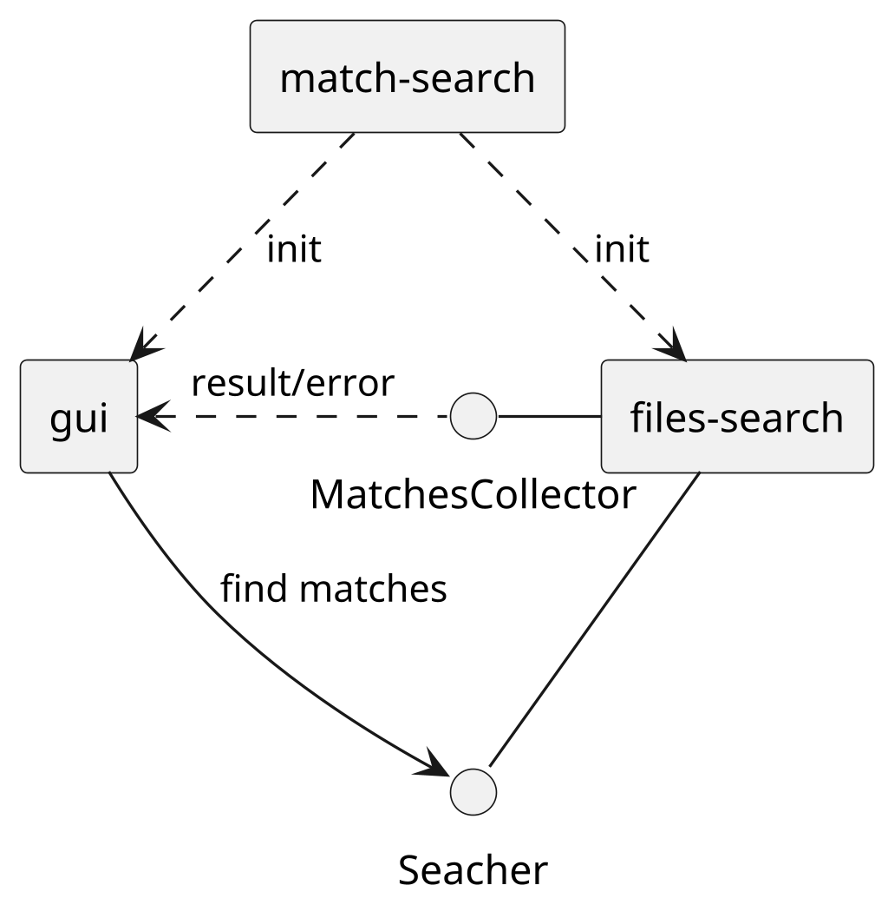

# match-search

Simple application that does recursive search for matches with regular expression.
It's a GUI application based on Qt6 and it obtains path and regular expression from the user.

## Requirements

In order to build it you need:

* Compiler supporting `std::expect`, GCC-14 for example,
* CMake
* Qt6,
* GTest and GMock.

Nevertheless it's possible to use VSCode extension **Dev Containers** and open that project in provided Ubuntu Noble 
container with all dependencies installed.

## Architecture

This application consists of several modules:

* **files-search** - the core library responsible for searching process,
* **gui** - library representing user interface,
* **match-search** - the executable that combines both libraries together.

The overall architecture is depicted on the diagram bellow:

